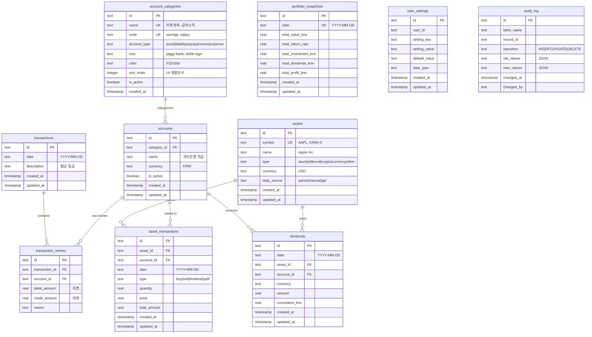

# PAMS Database Design Specification

## 개요

PAMS (Personal Asset Management System)는 복식부기 원칙을 기반으로 한 개인 자산 관리 시스템입니다. 이 문서는 개선된 데이터베이스 설계와 ERD를 제시합니다.

## ERD (Entity Relationship Diagram)



## 핵심 설계 원칙

### 1. 복식부기 (Double-Entry Bookkeeping)
- 모든 거래는 차변(debit)과 대변(credit)이 균형을 이뤄야 함
- `transaction_entries` 테이블에서 각 항목은 차변 또는 대변 중 하나만 값을 가짐
- 거래 레벨에서 차변 합계 = 대변 합계 보장

### 2. 계정 분류 시스템
- 전통적인 5가지 계정 유형: 자산, 부채, 자본, 수익, 비용
- 사용자 친화적인 카테고리로 세분화 (저축계좌, 투자계좌, 급여소득 등)
- UI 최적화를 위한 아이콘, 색상, 정렬순서 지원

### 3. 투자 관리
- 일반 회계와 투자 관리의 통합
- 복식부기 원칙을 유지하면서 포트폴리오 추적
- 다중 화폐 지원

## 테이블 상세 설계

### account_categories (계정 카테고리)

계정의 사용자 친화적 분류를 위한 마스터 테이블

```sql
CREATE TABLE account_categories (
  id TEXT PRIMARY KEY,
  name TEXT UNIQUE NOT NULL,           -- 사용자에게 표시되는 이름
  code TEXT UNIQUE NOT NULL,           -- 시스템 내부 코드
  account_type TEXT NOT NULL CHECK (account_type IN ('asset', 'liability', 'equity', 'income', 'expense')),
  icon TEXT,                           -- UI 아이콘 (Lucide 아이콘명)
  color TEXT,                          -- UI 색상 (HEX)
  sort_order INTEGER DEFAULT 0,       -- UI 정렬 순서
  is_active BOOLEAN DEFAULT true,
  created_at TIMESTAMP DEFAULT CURRENT_TIMESTAMP
);
```

**기본 카테고리:**

| 카테고리 | 코드 | 계정타입 | 아이콘 | 색상 | 예시 |
|---------|------|---------|-------|------|------|
| 저축계좌 | savings | asset | piggy-bank | #22c55e | 적금, 예금 |
| 투자계좌 | investment | asset | trending-up | #3b82f6 | 증권계좌, 연금계좌 |
| 일반계좌 | checking | asset | credit-card | #6b7280 | 주거래은행 |
| 대출계좌 | loan | liability | banknote | #ef4444 | 주택대출, 신용대출 |
| 신용카드 | credit_card | liability | credit-card | #f59e0b | 신용카드 미결제 |
| 체크카드 | debit_card | asset | credit-card | #8b5cf6 | 직불카드 |
| 급여소득 | salary | income | dollar-sign | #10b981 | 월급, 보너스 |
| 사업소득 | business | income | briefcase | #059669 | 사업수익, 프리랜서 |
| 투자소득 | investment_income | income | trending-up | #0891b2 | 배당금, 이자 |
| 식비 | food | expense | utensils | #dc2626 | 식료품, 외식 |
| 교통비 | transport | expense | car | #ea580c | 대중교통, 유류비 |
| 생활비 | living | expense | home | #d97706 | 공과금, 통신비 |
| 의료비 | medical | expense | heart | #c2410c | 병원비, 약값 |
| 교육비 | education | expense | book-open | #a16207 | 학비, 도서 |
| 여가비 | entertainment | expense | gamepad-2 | #9333ea | 영화, 게임 |

### accounts (계정)

개별 계정 정보를 저장하는 테이블

```sql
CREATE TABLE accounts (
  id TEXT PRIMARY KEY,
  category_id TEXT NOT NULL REFERENCES account_categories(id),
  name TEXT NOT NULL,                  -- 계정명 (예: "국민은행 주거래")
  currency TEXT DEFAULT 'KRW' NOT NULL,
  is_active BOOLEAN DEFAULT true NOT NULL,
  created_at TIMESTAMP DEFAULT CURRENT_TIMESTAMP NOT NULL,
  updated_at TIMESTAMP DEFAULT CURRENT_TIMESTAMP NOT NULL
);

CREATE INDEX idx_accounts_category ON accounts(category_id);
CREATE INDEX idx_accounts_active ON accounts(is_active) WHERE is_active = true;
```

### transactions & transaction_entries (거래 및 거래항목)

복식부기 거래를 기록하는 핵심 테이블

```sql
CREATE TABLE transactions (
  id TEXT PRIMARY KEY,
  date TEXT NOT NULL,                  -- YYYY-MM-DD 형식
  description TEXT NOT NULL,           -- 거래 설명
  created_at TIMESTAMP DEFAULT CURRENT_TIMESTAMP NOT NULL,
  updated_at TIMESTAMP DEFAULT CURRENT_TIMESTAMP NOT NULL
);

CREATE TABLE transaction_entries (
  id TEXT PRIMARY KEY,
  transaction_id TEXT NOT NULL REFERENCES transactions(id) ON DELETE CASCADE,
  account_id TEXT NOT NULL REFERENCES accounts(id) ON DELETE RESTRICT,
  debit_amount REAL,                   -- 차변 (자산/비용 증가)
  credit_amount REAL,                  -- 대변 (부채/자본/수익 증가)
  memo TEXT,
  
  -- 복식부기 제약조건: 차변 또는 대변 중 하나만 값을 가져야 함
  CONSTRAINT debit_or_credit_check CHECK (
    (debit_amount IS NOT NULL AND credit_amount IS NULL) OR 
    (debit_amount IS NULL AND credit_amount IS NOT NULL)
  )
);

CREATE INDEX idx_transaction_entries_transaction ON transaction_entries(transaction_id);
CREATE INDEX idx_transaction_entries_account ON transaction_entries(account_id);
CREATE INDEX idx_transactions_date ON transactions(date);
```

**복식부기 균형 검증 트리거:**

```sql
CREATE TRIGGER trg_transaction_balance_insert
AFTER INSERT ON transaction_entries
BEGIN
  SELECT CASE 
    WHEN ABS(
      COALESCE((SELECT SUM(debit_amount) FROM transaction_entries WHERE transaction_id = NEW.transaction_id), 0) - 
      COALESCE((SELECT SUM(credit_amount) FROM transaction_entries WHERE transaction_id = NEW.transaction_id), 0)
    ) > 0.01
    THEN RAISE(ABORT, 'Transaction must be balanced: debits must equal credits')
  END;
END;

CREATE TRIGGER trg_transaction_balance_update
AFTER UPDATE ON transaction_entries
BEGIN
  SELECT CASE 
    WHEN ABS(
      COALESCE((SELECT SUM(debit_amount) FROM transaction_entries WHERE transaction_id = NEW.transaction_id), 0) - 
      COALESCE((SELECT SUM(credit_amount) FROM transaction_entries WHERE transaction_id = NEW.transaction_id), 0)
    ) > 0.01
    THEN RAISE(ABORT, 'Transaction must be balanced: debits must equal credits')
  END;
END;
```

### assets & asset_transactions (자산 및 자산거래)

투자 자산 관리를 위한 테이블

```sql
CREATE TABLE assets (
  id TEXT PRIMARY KEY,
  symbol TEXT UNIQUE NOT NULL,         -- 심볼 (AAPL, 005930.KS)
  name TEXT NOT NULL,                  -- 자산명
  type TEXT NOT NULL CHECK (type IN ('stock', 'etf', 'bond', 'crypto', 'currency', 'other')),
  currency TEXT DEFAULT 'KRW' NOT NULL,
  data_source TEXT NOT NULL CHECK (data_source IN ('yahoo', 'manual', 'api')),
  created_at TIMESTAMP DEFAULT CURRENT_TIMESTAMP NOT NULL,
  updated_at TIMESTAMP DEFAULT CURRENT_TIMESTAMP NOT NULL
);

CREATE TABLE asset_transactions (
  id TEXT PRIMARY KEY,
  asset_id TEXT NOT NULL REFERENCES assets(id) ON DELETE RESTRICT,
  account_id TEXT NOT NULL REFERENCES accounts(id) ON DELETE RESTRICT,
  date TEXT NOT NULL,
  type TEXT NOT NULL CHECK (type IN ('buy', 'sell', 'dividend', 'split')),
  quantity REAL NOT NULL,
  price REAL NOT NULL,
  total_amount REAL NOT NULL,
  created_at TIMESTAMP DEFAULT CURRENT_TIMESTAMP NOT NULL,
  updated_at TIMESTAMP DEFAULT CURRENT_TIMESTAMP NOT NULL
);

CREATE INDEX idx_asset_transactions_asset ON asset_transactions(asset_id);
CREATE INDEX idx_asset_transactions_account ON asset_transactions(account_id);
CREATE INDEX idx_asset_transactions_date ON asset_transactions(date);
```

### 현재 보유 자산 조회

현재 보유 중인 자산은 `asset_transactions` 테이블에서 계산으로 구합니다:

```sql
-- 계정별 현재 보유 자산 (매수량 - 매도량 > 0)
CREATE VIEW current_holdings AS
SELECT 
  account_id,
  asset_id,
  SUM(CASE 
    WHEN type = 'buy' THEN quantity 
    WHEN type = 'sell' THEN -quantity 
    ELSE 0 
  END) as current_quantity,
  AVG(CASE WHEN type = 'buy' THEN price END) as avg_purchase_price
FROM asset_transactions 
WHERE type IN ('buy', 'sell')
GROUP BY account_id, asset_id
HAVING current_quantity > 0;
```

### dividends (배당금)

배당금 수령 내역 추적

```sql
CREATE TABLE dividends (
  id TEXT PRIMARY KEY,
  date TEXT NOT NULL,
  asset_id TEXT NOT NULL REFERENCES assets(id) ON DELETE RESTRICT,
  account_id TEXT NOT NULL REFERENCES accounts(id) ON DELETE RESTRICT,
  currency TEXT NOT NULL,
  amount REAL NOT NULL,
  cumulative_krw REAL,                 -- 누적 원화 환산액
  created_at TIMESTAMP DEFAULT CURRENT_TIMESTAMP NOT NULL,
  updated_at TIMESTAMP DEFAULT CURRENT_TIMESTAMP NOT NULL
);

CREATE INDEX idx_dividends_asset ON dividends(asset_id);
CREATE INDEX idx_dividends_account ON dividends(account_id);
CREATE INDEX idx_dividends_date ON dividends(date);
```

### portfolio_snapshots (포트폴리오 스냅샷)

일별 포트폴리오 가치 기록

```sql
CREATE TABLE portfolio_snapshots (
  id TEXT PRIMARY KEY,
  date TEXT UNIQUE NOT NULL,           -- YYYY-MM-DD
  total_value_krw REAL NOT NULL,       -- 총 자산가치 (원화)
  total_return_rate REAL NOT NULL,     -- 총 수익률
  total_investment_krw REAL NOT NULL,  -- 총 투자원금
  total_dividends_krw REAL NOT NULL,   -- 총 배당금
  total_profit_krw REAL NOT NULL,      -- 총 수익금
  created_at TIMESTAMP DEFAULT CURRENT_TIMESTAMP NOT NULL,
  updated_at TIMESTAMP DEFAULT CURRENT_TIMESTAMP NOT NULL
);

CREATE INDEX idx_portfolio_snapshots_date ON portfolio_snapshots(date);
```

### 지원 테이블들

**user_settings (사용자 설정):**

```sql
CREATE TABLE user_settings (
  id TEXT PRIMARY KEY,
  user_id TEXT NOT NULL,
  setting_key TEXT NOT NULL,
  setting_value TEXT,
  default_value TEXT,
  data_type TEXT DEFAULT 'string',     -- string, number, boolean, json
  created_at TIMESTAMP DEFAULT CURRENT_TIMESTAMP NOT NULL,
  updated_at TIMESTAMP DEFAULT CURRENT_TIMESTAMP NOT NULL,
  
  UNIQUE(user_id, setting_key)
);

CREATE INDEX idx_user_settings_user ON user_settings(user_id);
```

**audit_log (감사 로그):**

```sql
CREATE TABLE audit_log (
  id TEXT PRIMARY KEY,
  table_name TEXT NOT NULL,
  record_id TEXT NOT NULL,
  operation TEXT NOT NULL CHECK (operation IN ('INSERT', 'UPDATE', 'DELETE')),
  old_values TEXT,                     -- JSON
  new_values TEXT,                     -- JSON
  changed_at TIMESTAMP DEFAULT CURRENT_TIMESTAMP,
  changed_by TEXT                      -- 향후 multi-user 지원
);

CREATE INDEX idx_audit_log_table ON audit_log(table_name);
CREATE INDEX idx_audit_log_record ON audit_log(record_id);
CREATE INDEX idx_audit_log_date ON audit_log(changed_at);
```

## 데이터 무결성 보장

### 1. 복식부기 균형 검증
- 트리거를 통한 실시간 차변/대변 균형 검증
- 0.01 원 이내의 부동소수점 오차 허용

### 2. 참조 무결성
- 모든 외래키에 적절한 ON DELETE 정책 설정
- CASCADE: 부모 삭제 시 자식도 삭제 (transaction_entries)
- RESTRICT: 자식이 존재하면 부모 삭제 방지 (accounts, assets)

### 3. 데이터 검증
- CHECK 제약조건으로 enum 값 검증
- UNIQUE 제약조건으로 중복 방지
- NOT NULL 제약조건으로 필수 데이터 보장

## 성능 최적화

### 인덱스 전략
- 자주 조회되는 컬럼에 인덱스 생성
- 복합 인덱스로 특정 쿼리 패턴 최적화
- 날짜 기반 조회를 위한 date 컬럼 인덱스

### 쿼리 최적화
- 카테고리별 계정 그룹핑 쿼리 최적화
- 포트폴리오 성과 집계 쿼리 최적화
- 거래 내역 검색 쿼리 최적화

## 확장성 고려사항

### 1. 다중 사용자 지원
- 모든 테이블에 user_id 추가 준비
- 사용자별 데이터 격리

### 2. 다중 화폐 지원
- 화폐별 환율 테이블 추가 가능
- 실시간 환율 API 연동 준비

### 3. 고급 기능
- 예산 관리 테이블
- 목표 설정 테이블
- 알림 설정 테이블

## 마이그레이션 계획

### Phase 1: 핵심 구조 변경
1. `account_categories` 테이블 생성 및 기본 데이터 입력
2. `accounts` 테이블에 `category_id` 추가
3. 기존 `type` 필드에서 `category_id`로 데이터 마이그레이션
4. 복식부기 균형 검증 트리거 추가

### Phase 2: 무결성 강화
1. 외래키 제약조건 추가
2. 필수 인덱스 생성
3. 감사 로그 시스템 구축

### Phase 3: 성능 최적화
1. 성능 모니터링 및 슬로우 쿼리 분석
2. 추가 인덱스 생성
3. 쿼리 최적화

이 설계는 복식부기의 엄격함을 유지하면서도 사용자 친화적인 개인 자산 관리 시스템을 구현할 수 있는 견고한 기반을 제공합니다.

## 데이터베이스 관리 스크립트

### 개요

`package.json`에 추가된 스크립트들을 통해 Drizzle ORM과 Cloudflare D1 데이터베이스를 효율적으로 관리할 수 있습니다. 모든 스크립트는 `schema.ts`를 기준으로 동작합니다.

### 기본 데이터베이스 관리

#### `pnpm db:generate`
```bash
pnpm db:generate
```
- **목적**: Drizzle Kit을 사용하여 `schema.ts` 변경사항을 기반으로 SQL 마이그레이션 파일 생성
- **출력**: `drizzle/` 디렉토리에 새로운 마이그레이션 파일 생성
- **사용 시점**: `schema.ts` 수정 후

#### `pnpm db:push`
```bash
pnpm db:push
```
- **목적**: Drizzle Kit의 HTTP driver를 사용하여 스키마를 직접 푸시 (마이그레이션 파일 없이)
- **주의**: D1 HTTP driver 설정 필요 (accountId, databaseId, token)
- **사용 시점**: 개발 중 빠른 스키마 동기화

### 로컬 D1 데이터베이스 관리

#### `pnpm db:migrate:local`
```bash
pnpm db:migrate:local
```
- **목적**: 생성된 마이그레이션을 로컬 D1 데이터베이스에 적용
- **실행**: `wrangler d1 migrations apply pams-d1 --local`
- **사용 시점**: 마이그레이션 파일 생성 후

#### `pnpm db:sync:local`
```bash
pnpm db:sync:local
```
- **목적**: 마이그레이션 생성 + 로컬 적용을 한 번에 실행
- **실행 순서**: `db:generate` → `db:migrate:local`
- **사용 시점**: `schema.ts` 변경 후 로컬 동기화

#### `pnpm db:reset:local`
```bash
pnpm db:reset:local
```
- **목적**: 로컬 데이터베이스 완전 초기화 및 재구축
- **실행 순서**: 
  1. 모든 테이블 DROP
  2. `db:sync:local` 실행
  3. `db:seed` 실행 (기본 데이터 삽입)
- **주의**: ⚠️ 모든 데이터가 삭제됩니다
- **사용 시점**: 개발 중 데이터베이스 완전 초기화 필요 시

#### `pnpm db:seed`
```bash
pnpm db:seed
```
- **목적**: 기본 계정 카테고리 데이터를 로컬 D1에 삽입
- **파일**: `scripts/seed.sql` 실행
- **데이터**: 15개 기본 카테고리 (자산 4개, 부채 2개, 수익 3개, 비용 6개)
- **사용 시점**: 초기 설정 또는 데이터 초기화 후

#### `pnpm db:status`
```bash
pnpm db:status
```
- **목적**: 로컬 D1 데이터베이스의 테이블 목록 확인
- **출력**: 현재 생성된 모든 테이블 이름
- **사용 시점**: 데이터베이스 상태 확인

### 원격 D1 데이터베이스 관리

#### `pnpm db:migrate:remote`
```bash
pnpm db:migrate:remote
```
- **목적**: 생성된 마이그레이션을 원격(프로덕션) D1 데이터베이스에 적용
- **실행**: `wrangler d1 migrations apply pams-d1 --remote`
- **주의**: ⚠️ 프로덕션 환경에 영향을 미칩니다
- **사용 시점**: 프로덕션 배포 시

#### `pnpm db:sync:remote`
```bash
pnpm db:sync:remote
```
- **목적**: 마이그레이션 생성 + 원격 적용을 한 번에 실행
- **실행 순서**: `db:generate` → `db:migrate:remote`
- **주의**: ⚠️ 프로덕션 환경에 영향을 미칩니다
- **사용 시점**: `schema.ts` 변경 후 프로덕션 동기화

#### `pnpm db:reset:remote`
```bash
pnpm db:reset:remote
```
- **목적**: 원격 데이터베이스 완전 초기화 및 재구축
- **실행 순서**:
  1. 모든 테이블 DROP (원격)
  2. `db:sync:remote` 실행
  3. `db:seed:remote` 실행
- **주의**: ⚠️⚠️ 프로덕션 데이터가 모두 삭제됩니다
- **사용 시점**: 프로덕션 환경 완전 재구축 (극히 신중히 사용)

#### `pnpm db:seed:remote`
```bash
pnpm db:seed:remote
```
- **목적**: 기본 계정 카테고리 데이터를 원격 D1에 삽입
- **파일**: `scripts/seed.sql` 실행 (원격)
- **사용 시점**: 프로덕션 초기 설정

#### `pnpm db:status:remote`
```bash
pnpm db:status:remote
```
- **목적**: 원격 D1 데이터베이스의 테이블 목록 확인
- **사용 시점**: 프로덕션 데이터베이스 상태 확인

### 일반적인 사용 패턴

#### 개발 중 스키마 변경
```bash
# 1. schema.ts 수정
# 2. 로컬 동기화
pnpm db:sync:local

# 3. 상태 확인
pnpm db:status
```

#### 개발 환경 완전 초기화
```bash
# 모든 데이터 삭제 후 재구축
pnpm db:reset:local
```

#### 프로덕션 배포
```bash
# 1. 로컬에서 테스트 완료 후
# 2. 원격 동기화
pnpm db:sync:remote

# 3. 원격 상태 확인
pnpm db:status:remote
```

#### 트러블슈팅
```bash
# 로컬/원격 상태 비교
pnpm db:status
pnpm db:status:remote

# 마이그레이션 파일 수동 확인
ls -la drizzle/
```

### 파일 구조

```
├── drizzle/                    # 마이그레이션 파일
│   ├── 0000_complete_blizzard.sql
│   └── meta/
├── scripts/
│   └── seed.sql               # 기본 데이터 시드
├── src/lib/db/
│   └── schema.ts              # 데이터베이스 스키마 정의
├── drizzle.config.ts          # Drizzle 설정
└── package.json               # 데이터베이스 관리 스크립트
```

### 주의사항

1. **원격 스크립트 사용 시 주의**: `*:remote` 스크립트는 프로덕션 환경에 직접 영향을 미칩니다.
2. **reset 스크립트 위험성**: `db:reset:*` 스크립트는 모든 데이터를 삭제합니다.
3. **마이그레이션 순서**: 항상 로컬에서 테스트 후 원격에 적용하세요.
4. **백업**: 중요한 변경 전에는 데이터베이스 백업을 권장합니다.